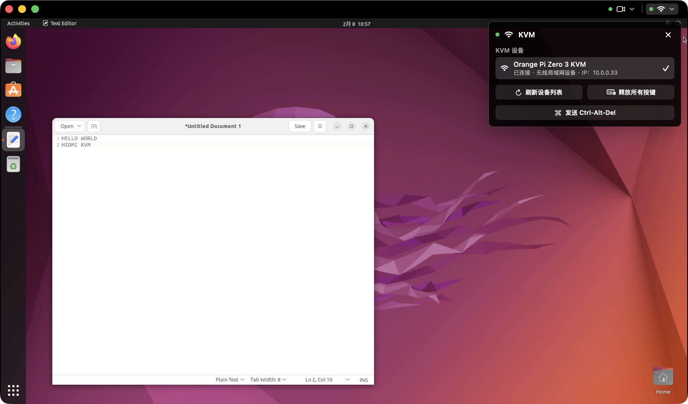

# HIDMI

语言：中文 | [English](README.md)

HIDMI 是一个本地网络硬件级 KVM 项目。它让 Mac 显示目标电脑的 HDMI 画面，并通过一台支持 USB gadget 的 Linux 设备向目标电脑发送标准 USB HID 键盘和鼠标输入。



目标电脑不需要安装代理软件；只要它能输出 HDMI 并识别 USB 键盘鼠标，就可以在 BIOS、启动菜单、安装器和操作系统内被控制。

## 项目状态

- 当前仓库包含 macOS 客户端、Linux 服务端、protobuf 协议定义和本地调试工具。
- 当前以源码构建、本地 DMG 打包和本地部署为主。
- 服务端需要安装硬件配置 profile；新设备通常需要新增或调整 profile。

## 支持设备

- [x] Orange Pi Zero 3 -> [orangepi-zero-3.toml](./server/conf/orangepi-zero-3.toml)

## 功能亮点

- **把 Mac 变成 KVM 控制台**：在 macOS 应用中查看目标电脑画面，并直接发送键盘、鼠标、滚轮和特殊按键操作。
- **目标电脑无需安装软件**：输入通过 USB HID 设备呈现，可用于 BIOS、启动菜单、系统安装器和常规桌面环境。
- **本地网络发现和令牌鉴权**：Mac 可以在局域网内发现服务端，并通过共享令牌降低误连风险。
- **面向设备部署和排障**：服务端提供安装、systemd 集成、状态检查、运行时诊断和 LED 状态指示。

## 工作原理

1. HDMI 采集设备把目标电脑画面输入到 Mac。

2. macOS 客户端显示画面，并把鼠标和键盘输入发送到 Linux 设备。

3. Linux 设备通过 USB gadget 把输入写成标准 HID 键盘和鼠标报告，目标电脑会把它识别为普通 USB 外设。

## 硬件和系统要求

- Mac：macOS `26.0` 或更新版本；从源码构建需要支持 Swift `6.0` 的 Xcode。
- 视频采集：AVFoundation 支持的 HDMI 采集设备。
- Linux 设备：支持 USB OTG 设备模式、Linux USB gadget/configfs、systemd、C++17 编译器、`protoc` 和 protobuf 开发库。
- 目标电脑：具备 HDMI 输出，并能识别 USB 键盘和鼠标。
- 网络：Mac 和 Linux 设备位于同一个局域网内，UDP 端口 `55536` 不应被阻断。

## 安装

### Linux 服务端

使用根目录 CMake 快捷脚本构建服务端二进制文件，或在目标 Linux 设备上直接使用 Make。

```bash
./build_server.sh
# 或：
make -C server
```

根目录的 `build_server.sh` 会把二进制文件写入 `build/server-cmake/hidmi`。使用 `./build_server.sh --test` 可以在构建后运行 C++ 测试。

在 Linux 设备上安装服务端二进制文件，然后使用共享令牌安装受支持的硬件配置。

```bash
sudo make -C server install
sudo hidmi install <profile> --token '<token>'
sudo hidmi status
```

安装目标使用 `server/Makefile`，并会在需要时自行构建对应产物。

安装自定义硬件配置时，可以使用 `--config` 替代配置名称。

```bash
sudo hidmi install --config server/conf/<profile>.toml --token '<token>'
```

### macOS 客户端

从源码构建 Release 应用。构建产物会写入 `build/macos/Release/HIDMI.app`。

```bash
./package_dmg.sh
```

根目录的 `package_dmg.sh` 会构建 Release 应用并生成 `build/dist/HIDMI.dmg`。使用 `./package_dmg.sh --skip-build` 可以直接打包已有 app bundle。

只需要构建 app 时，可以直接使用 Xcode。

```bash
xcodebuild build -project client/macos/HIDMI.xcodeproj -scheme HIDMI -configuration Release
open build/macos/Release/HIDMI.app
```

## 快速开始

1. 将目标电脑的 HDMI 输出连接到采集设备，并把采集设备连接到 Mac。

2. 将 Linux 设备的 USB gadget 端口连接到目标电脑。目标电脑会把它识别为 USB 键盘和鼠标。

3. 确保 Mac 和 Linux 设备位于同一个局域网内。

4. 在 Linux 设备上启动服务，并确认状态正常。

   ```bash
   sudo systemctl start hidmi.service
   sudo hidmi status
   ```

5. 打开 macOS 端 HIDMI 应用。应用会自动开始发现设备，但启动时不会自动连接，也不会自动弹出令牌提示。

6. 从 `Video` 菜单或状态区域选择 HDMI 采集设备。如果 macOS 请求摄像头权限，请在系统设置中允许访问。

7. 从 `Input` 菜单选择发现到的 KVM 设备并连接。如果设备需要令牌，请通过令牌管理流程添加或选择令牌。

8. 连接建立后，在视频预览区域内移动指针、点击、滚动和输入键盘。

9. 如果目标电脑看起来有按键或按钮保持按下状态，请使用 `Release All Keys`；需要特殊组合键时，请使用 `Send Ctrl-Alt-Del`。

## 诊断与状态

当发现、连接、USB HID 输出或 LED 指示不符合预期时，请在 Linux 设备上运行状态命令。

```bash
sudo hidmi status
```

该命令需要 `sudo`，因为它会检查 systemd 服务、HID gadget 节点、已配置的 UDC state 路径、UDP 监听状态、LED sysfs 路径，以及 `/run/hidmi/status.json` 运行时状态文件。完整的输出示例、字段含义和常见状态值请参阅 [docs/diagnostics.cn.md](docs/diagnostics.cn.md)。

### LED 状态速查

当已配置的硬件配置提供 LED 路径时，主 LED 记为 `P`，副 LED 记为 `S`。下表中的每个序列都使用 5 个对齐时间槽；`🟢⚫` 或 `🔴⚫` 表示一次闪烁，`⚫⚫` 表示该槽熄灭，连续纯色表示常亮。

| LED | 序列 | 含义 |
| --- | --- | --- |
| `P` | 🟢⚫ 🟢⚫ 🟢⚫ ⚫⚫ ⚫⚫ | 空闲。 |
| `P` | 🟢🟢 🟢🟢 🟢🟢 🟢🟢 🟢🟢 | 已连接客户端。 |
| `P` | 🟢⚫ 🟢⚫ 🟢⚫ 🟢⚫ 🟢⚫ | 临时协议、网络或认证错误。 |
| `S` | ⚫⚫ ⚫⚫ ⚫⚫ ⚫⚫ ⚫⚫ | 就绪。 |
| `S` | 🔴⚫ ⚫⚫ ⚫⚫ ⚫⚫ ⚫⚫ | USB 未配置。 |
| `S` | 🔴⚫ 🔴⚫ ⚫⚫ ⚫⚫ ⚫⚫ | HID 节点不可用。 |
| `S` | 🔴⚫ 🔴⚫ 🔴⚫ ⚫⚫ ⚫⚫ | HID 写入失败。 |
| `S` | 🔴⚫ 🔴⚫ 🔴⚫ 🔴⚫ ⚫⚫ | Gadget 不可用。 |
| `S` | 🔴⚫ 🔴⚫ 🔴⚫ 🔴⚫ 🔴⚫ | 绝对指针降级。 |

## 常见问题

### 目标电脑需要安装软件吗？

不需要。HIDMI 在目标电脑一侧表现为标准 USB 键盘和鼠标，目标电脑只需要能接收 HDMI 输入和 USB HID 输入。

### 支持哪些目标系统？

只要目标电脑能识别标准 USB 键盘和鼠标，通常就可以被控制。这个路径不依赖目标操作系统中的代理软件，因此也适用于 BIOS、启动菜单和系统安装流程。

### 为什么应用中没有显示 KVM 设备？

请确认 Linux 设备和 Mac 位于同一个局域网、UDP 端口 `55536` 未被阻止、服务端正在运行，并且 `sudo hidmi status` 显示服务和 HID 设备状态正常。

### 为什么能看到画面但不能输入？

请检查 `Input` 菜单是否已连接 KVM 设备、服务端 HID gadget 是否已配置、目标电脑是否识别到 USB 键盘鼠标，以及 `sudo hidmi status` 中的 HID 相关状态。

### 为什么应用会显示令牌提示？

生产服务端需要配置共享令牌。请使用 `hidmi install` 打印的令牌，或使用安装时通过 `--token` 指定的令牌。

### 如何添加新的硬件配置？

服务端硬件配置位于 `server/conf/`。新增设备通常需要提供 HID 节点、UDC state 路径和 LED 路径等配置；开发和验证流程请参阅 [docs/dev.cn.md](docs/dev.cn.md)。

## 更多文档

- [开发指南](docs/dev.cn.md)：构建、测试、protobuf 生成和本地 smoke 流程。
- [诊断参考](docs/diagnostics.cn.md)：`sudo hidmi status` 输出示例、字段说明和排查顺序。
- [协议说明](docs/protocol.cn.md)：当前 protobuf UDP/TCP 协议、认证和输入语义。
